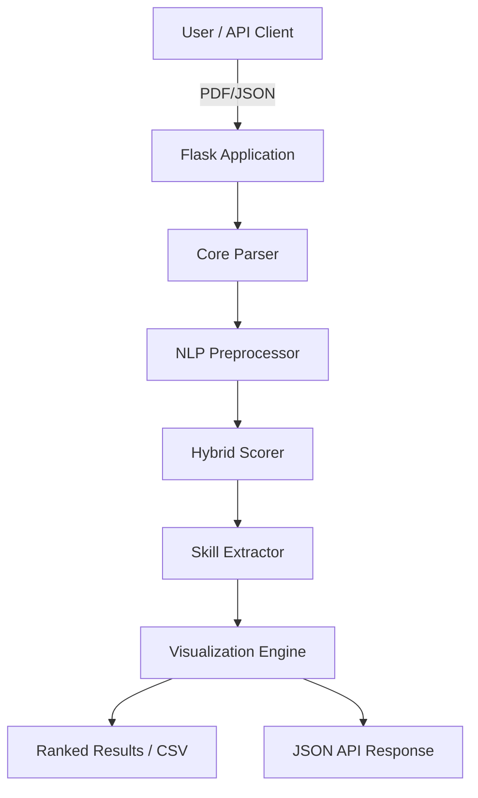

# HireMatch 🎯

> **Resume Intelligence Engine** — Match resumes against job descriptions using Hybrid NLP scoring. Extract skills, rank candidates, and export results — all offline, no external APIs required.


---

## 📸 Screenshots

| Upload & Analyse | Match Results | Batch Ranking |
|---|---|---|
| *Upload form with drag-and-drop* | *Score ring + skill tags* | *Candidate leaderboard + CSV export* |

---

## 🚀 What It Does

HireMatch analyses how well a resume matches a job description using classical NLP — no LLMs, no cloud calls, no API keys.

| Feature | Detail |
|---|---|
| **PDF Parsing** | High-fidelity text extraction via `pdfplumber` with MIME-type validation |
| **Text Preprocessing** | Lowercase → URL/email strip → punctuation removal → NLTK lemmatisation |
| **Hybrid Scoring** | Combined **TF-IDF Semantic Similarity** (40%) + **Keyword Density** (60%) |
| **REST API** | Full programmatic access via `/api/analyze` and `/api/rank` endpoints |
| **Skill Extraction** | Rule-based extraction of 300+ skills across 10+ categories |
| **Batch Ranking** | Optimized batch vectorization for high-performance ranking (O(1) fits) |
| **CSV Export** | Export candidate leaderboards directly to spreadsheets |
| **Fully Offline** | 100% data privacy — zero external cloud calls or API keys required |

---

## 🏗 Architecture

```
resume_job_matcher/
├── core/                   # Pure business logic (no Flask)
│   ├── parser.py           # PDF → text (pdfplumber)
│   ├── preprocessor.py     # NLP cleaning pipeline (NLTK)
│   ├── scorer.py           # TF-IDF + cosine similarity
│   ├── skill_extractor.py  # Rule-based skill detection
│   ├── visualizer.py       # Ranking, DataFrame, CSV export
│   └── logging_config.py   # Centralised logging setup
├── app/
│   ├── routes.py           # Flask Blueprint (HTTP layer only)
│   └── config.py           # Dev / Prod / Test configuration
├── data/
│   └── skills_dict.py      # Skill taxonomy + aliases (300+ skills)
├── templates/              # Jinja2 HTML templates
├── static/                 # CSS + JS
├── tests/                  # 277-test pytest suite
│   ├── conftest.py
│   ├── test_parser.py
│   ├── test_preprocessor.py
│   ├── test_scorer.py
│   ├── test_scorer_extended.py
│   ├── test_skill_extractor.py
│   ├── test_routes.py
│   └── test_integration_pipeline.py
├── run.py                  # App factory + entry point
├── gunicorn.conf.py        # Production WSGI config
├── Procfile                # Render / Railway deploy
├── pyproject.toml          # pytest + coverage + black + isort
├── Makefile                # Developer task runner
├── requirements.txt
├── requirements-dev.txt
└── .env.example
```

### Data Flow



---

## ⚙️ Setup

### Prerequisites
- Python 3.11+
- pip

### 1. Clone & create virtual environment

```bash
git clone https://github.com/AtharvaVavhal/HireMatch.git
cd HireMatch
python3 -m venv venv
source venv/bin/activate        # Windows: venv\Scripts\activate
```

### 2. Install dependencies

```bash
pip install -r requirements-dev.txt   # includes test tools
# or for production only:
pip install -r requirements.txt
```

### 3. Configure environment

```bash
cp .env.example .env
# Edit .env — at minimum set SECRET_KEY for production
```

### 4. Run

```bash
# Development
python run.py
# or
make run

# Production (gunicorn)
gunicorn -c gunicorn.conf.py "run:app"
```

Open **http://localhost:5000**

---

## 🧪 Testing

```bash
# Run all 277 tests
make test

# With terminal coverage report
make cov-term

# With HTML coverage report (open htmlcov/index.html)
make cov

# Per-module
make test-parser
make test-scorer
make test-skills
make test-preprocessor
make test-routes
make test-int          # integration tests only

# Stop on first failure
make test-fast
```

| Module | Coverage |
|---|---|
| `core/preprocessor.py` | **100%** |
| `core/scorer.py` | **100%** |
| `core/skill_extractor.py` | 98% |
| `core/parser.py` | 94% |
| `app/routes.py` | 83% |

---

## 🔒 Privacy & Data Security

HireMatch is designed with a **privacy-first** architecture:
- **Zero-Cloud**: No data is sent to OpenAI, Google, or any external NLP service. Everything stays on your local machine.
- **Auto-Cleanup**: Temporary uploads and output CSVs are automatically purged every hour via `core/cleanup.py`.
- **MIME Validation**: Secondary file-header verification prevents malicious file uploads.
- **No Persistence**: Candidate PII is processed in-memory and not stored in any database.

---

---

## 📖 Usage

### Mode 1 — Single Resume Analysis

1. Open http://localhost:5000
2. Upload a PDF resume
3. Paste the job description
4. Click **Analyse Resume**
5. View match score (0–100%), matched skills, and missing skills

### Mode 2 — Batch Ranking

1. Open http://localhost:5000
2. Upload multiple PDF resumes (up to 20)
3. Paste the job description
4. Click **Rank All Resumes**
5. View the candidate leaderboard
6. Download the ranked CSV

### Score Interpretation

| Range | Label |
|---|---|
| 85 – 100% | 🟢 Excellent Match |
| 65 – 84% | 🔵 Good Match |
| 45 – 64% | 🟡 Moderate Match |
| 0 – 44% | 🔴 Poor Match |

---

## 🔧 Configuration

All settings are configurable via environment variables (see `.env.example`):

| Variable | Default | Description |
|---|---|---|
| `SECRET_KEY` | *(insecure default)* | Flask session secret — **change in production** |
| `FLASK_ENV` | `development` | `development` or `production` |
| `PORT` | `5000` | Server port |
| `MAX_UPLOAD_MB` | `16` | Max PDF size in MB |
| `MAX_BATCH_RESUMES` | `20` | Max resumes per batch |
| `LOG_LEVEL` | `INFO` | `DEBUG` / `INFO` / `WARNING` / `ERROR` |
| `LOG_TO_FILE` | `0` | `1` to write `logs/hirematch.log` |

---

## 🚀 Deployment

### Recommended: Render (Free tier)

1. Push to GitHub
2. Create a new **Web Service** on [Render](https://render.com)
3. Set **Build Command**: `pip install -r requirements.txt`
4. Set **Start Command**: `gunicorn -c gunicorn.conf.py "run:app"`
5. Add environment variables in the Render dashboard:
   ```
   SECRET_KEY=<generate with: python -c "import secrets; print(secrets.token_hex(32))">
   FLASK_ENV=production
   LOG_TO_FILE=0
   ```

### Railway

1. Connect GitHub repo on [Railway](https://railway.app)
2. Railway auto-detects `Procfile` → uses `gunicorn -c gunicorn.conf.py "run:app"`
3. Add `SECRET_KEY` and `FLASK_ENV=production` in Variables tab

### Platform comparison

| | Render | Railway | Replit |
|---|---|---|---|
| **Free tier** | ✅ 750h/mo | ✅ $5 credit | ✅ limited |
| **Custom domains** | ✅ | ✅ | ❌ paid |
| **Sleep on idle** | ✅ (free) | ❌ | ✅ |
| **Beginner UX** | ⭐⭐⭐⭐⭐ | ⭐⭐⭐⭐ | ⭐⭐⭐ |
| **Recommended** | ✅ **Yes** | ✅ Good alt | ⚠️ Last resort |

---

## 🛠 Developer Commands

```bash
make test          # Run all tests
make cov           # Coverage + HTML report
make lint          # flake8 + isort + black checks
make fmt           # Auto-format code
make clean         # Remove cache & build artefacts
make help          # Show all targets
```

---

## 🗺 Roadmap

### Near-term (realistic)
- [ ] **OCR support** — `pytesseract` for scanned/image PDFs
- [ ] **Job description URL input** — scrape JD from a URL
- [ ] **Section-aware parsing** — identify Skills / Experience / Education sections
- [ ] **Persistent history** — SQLite storage for past analyses

### Medium-term
- [ ] **Semantic matching** — `sentence-transformers` for meaning-aware scoring
- [ ] **FastAPI migration** — async endpoints, automatic OpenAPI docs
- [ ] **Auth** — GitHub OAuth, session-based user history
- [ ] **Export to PDF** — `reportlab` or `weasyprint` result reports

### Long-term / stretch
- [ ] **PostgreSQL** — replace SQLite for multi-user deployments
- [ ] **Celery + Redis** — async background processing for large batches
- [ ] **Docker Compose** — one-command local stack
- [ ] **LLM feedback** — "Why does this resume score low?" explanations

---

## 🤝 Contributing

1. Fork the repository
2. Create a feature branch: `git checkout -b feat/your-feature`
3. Write tests for new functionality
4. Ensure all tests pass: `make test`
5. Ensure code is formatted: `make fmt && make lint`
6. Open a Pull Request with a clear description

**Commit convention:**
```
feat: add OCR support for scanned PDFs
fix: handle empty vocabulary in TF-IDF scorer
test: add boundary tests for score labels
docs: update README with deployment steps
refactor: extract route helpers into utils module
```

---

## 📄 License

MIT License — see [LICENSE](LICENSE) for details.

---

## 👤 Author

**Atharva Vavhal**
- GitHub: [@AtharvaVavhal](https://github.com/AtharvaVavhal)
- Project: [HireMatch](https://github.com/AtharvaVavhal/HireMatch)

---

<p align="center">Built with Python · pdfplumber · scikit-learn · NLTK · Flask</p>
<p align="center">TF-IDF + Cosine Similarity · No cloud · No APIs · 100% offline</p>
